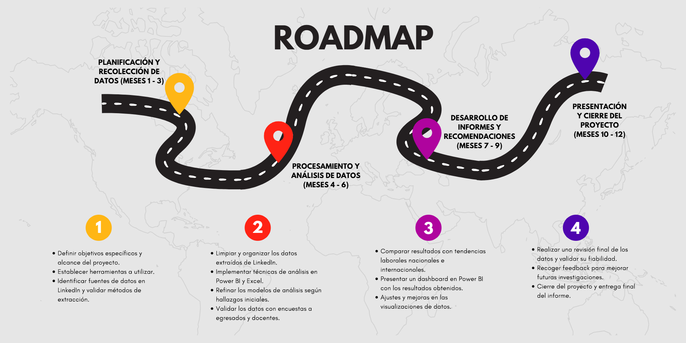

# **UNIVERSIDAD PRIVADA DE TACNA**  
## **FACULTAD DE INGENIERÍA**  
### **ESCUELA PROFESIONAL DE INGENIERÍA DE SISTEMAS**  

---

# **ANÁLISIS DEL PERFIL PROFESIONAL DE LOS EGRESADOS DE LA EPIS DE LA UPT EN LINKEDIN**

## **Curso:** Inteligencia de Negocios  
## **Docente:** Mag. Patrick Cuadros Quiroga  

---

### **Integrantes:**  
- **Villanueva Mamani, Royser Alonsso**  
- **Hinojosa Mucho, Christian Dennis**  
- **Chite Quispe, Brian Danilo** 
 

## RoadMap:

